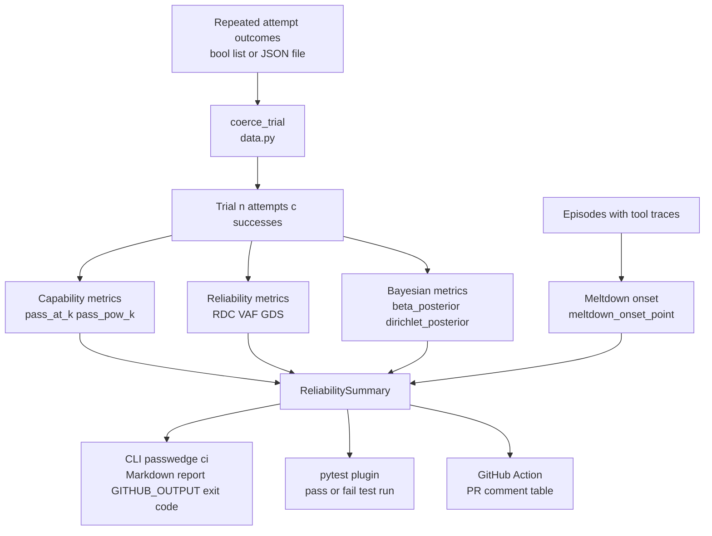

# passwedge

**Reliability-science metrics for repeated-attempt evaluation of long-horizon LLM agents.**

`pass@1` tells you whether a model *can* do a task once. It says nothing about whether an
agent does so *consistently* across repeated attempts — the property that actually matters
when a task takes hundreds of tool calls and one slip ends the run. passwedge measures that
gap: capability vs. reliability.

- **Pure Python** (`numpy` + `scipy` only), CPU-only, no GPU, no network, no API keys.
- **Every metric is implemented exactly as defined in its source paper**, with the equation
  and citation in [`docs/DEFINITIONS.md`](docs/DEFINITIONS.md). Where a paper gives a concept
  without one canonical estimator, passwedge documents its operationalization and never
  presents it as a verbatim reproduction.
- Ships three ways: a **library**, a **pytest plugin** (`@pytest.mark.passk`), and a
  **GitHub Action** that comments a reliability table on your PRs.

> Alpha (`0.0.1a2`). The API may change before `0.1.0`.

## Architecture



## Install

```bash
pip install passwedge
```

## Quickstart (library)

```python
import passwedge as pw

# 12 repeated attempts at one task; True = the attempt passed.
trial = pw.coerce_trial([True, True, False, True, True, False, True, True, True, False, True, True])

print("pass@1 :", pw.pass_at_k(trial.n, trial.c, 1))   # >=1 of 1 succeeds
print("pass@5 :", pw.pass_at_k(trial.n, trial.c, 5))   # >=1 of 5 succeeds
print("pass^5 :", pw.pass_pow_k(trial.n, trial.c, 5))  # ALL 5 succeed (reliability)

# Bayesian posterior over the task's true success probability (Jeffreys prior).
post = pw.beta_posterior(trial.c, trial.n)
print("posterior mean :", round(post.mean(), 3))
print("95% credible   :", tuple(round(x, 3) for x in post.credible_interval(0.95)))
print("E[p^5]         :", round(post.expected_pow_k(5), 3))  # expected all-5-success
```

## Quickstart (CI gate / GitHub Action)

Given a JSON file of task outcomes:

```json
[
  {"task_id": "t1", "duration_bucket": "short", "outcomes": [true, true, true, false]},
  {"task_id": "t2", "duration_bucket": "long",  "outcomes": [true, false, false, false]}
]
```

```bash
passwedge ci --input trials.json --k 1,2 --metric pass_pow_k --fail-under 0.5
```

prints a Markdown report, emits `$GITHUB_OUTPUT` values, and exits non-zero if the chosen
metric is below the threshold. In a workflow, use the bundled action:

```yaml
- uses: hinanohart/passwedge@v0.0.1a2
  with:
    input: trials.json
    fail-under: "0.5"
    metric: pass_pow_k
```

## Quickstart (pytest plugin)

```python
import pytest

@pytest.mark.passk(attempts=20, k=5, min_pass_pow_k=0.9)
def test_agent_is_reliable():
    assert run_agent().solved   # executed 20×; passes iff pass^5 >= 0.9
```

## How it works

### Data model

passwedge uses three levels of granularity, all accepting bare `list[bool]` at the entry point:

| Type | Purpose |
| --- | --- |
| `Trial` | Sufficient statistics (`n`, `c`) for one task across all attempts |
| `Episode` | One rollout: success flag + optional tool-call trace + subtask results |
| `Step` | One tool call inside an episode (required only for MOP) |

`coerce_trial()` accepts any of these forms and normalises them so every metric receives the same `Trial` object.

### Metrics

| Metric | Meaning | Source |
| --- | --- | --- |
| `pass_at_k` | probability >=1 of k attempts succeeds | Chen et al. 2021 (arXiv:2107.03374) |
| `pass_pow_k` | probability **all** k attempts succeed | Beyond pass@1 (arXiv:2603.29231), Def. 2 |
| `reliability_decay_curve` / `_slope` | how pass^k decays with task duration (RDC/RDS) | arXiv:2603.29231, Def. 3 |
| `variance_amplification_factor` | VAF: variance ratio long-vs-short bucket | arXiv:2603.29231, Def. 4 |
| `graceful_degradation_score` | GDS: weighted partial credit over subtasks | arXiv:2603.29231, Def. 5 |
| `meltdown_onset_point` | MOP: tool-call entropy collapse detector | arXiv:2603.29231, Def. 6 |
| `beta_posterior` / `dirichlet_posterior` | Bayesian posterior mean + credible interval, `E[p^k]` | Don't Pass@k (arXiv:2510.04265) |

> **Honest-marketing note.** arXiv:2510.04265 does **not** define a metric called "Bayes@k";
> passwedge's Bayesian helpers are *our* operationalization of that paper's Dirichlet
> framework. The `scorio` package (the paper's reference implementation) is the numeric
> baseline our test suite reproduces under a uniform prior.
>
> **MOP thresholds are dataset-specific.** `meltdown_onset_point` requires explicit
> `theta_h`, `delta`, `w` (no defaults). The paper's calibration is exposed as
> `MOP_PAPER_DEFAULTS` but applying it verbatim to other data produces false positives.

### Report and output

After computing metrics, `summarize()` produces a `ReliabilitySummary` dataclass. From there:

- `render_markdown()` formats a Markdown table for human reading or PR comments.
- The CLI (`passwedge ci`) writes the report, emits `$GITHUB_OUTPUT` key=value lines, and exits non-zero on threshold failure.
- The GitHub Action wraps the CLI and posts the table as a PR comment automatically.

## Where it fits

passwedge is the *measurement layer*: it consumes repeated-attempt outcomes (a bool list,
a JSON file, or a trace export) and reports reliability. It deliberately does **not** run
rollouts, score reward/fitness functions, audit reward gameability, or detect reward hacking
— those are separate concerns handled by tools such as
[`scorewright`](https://github.com/hinanohart/scorewright) (fitness scoring + anti-gaming),
[`rewardfuzz`](https://github.com/hinanohart/rewardfuzz) (reward gameability auditing), and
[`mav-bench`](https://github.com/hinanohart/mav-bench) (multi-agent verification). passwedge
sits one layer up from those: feed it the per-attempt pass/fail outcomes they (or any eval
harness) produce, and it tells you how *reliably* the agent succeeds. For confidence /
hallucination fragility see [`yuragi`](https://github.com/hinanohart/yuragi); for streaming
inference verification see [`conformlock`](https://github.com/hinanohart/conformlock).

## License

[MIT](LICENSE).
